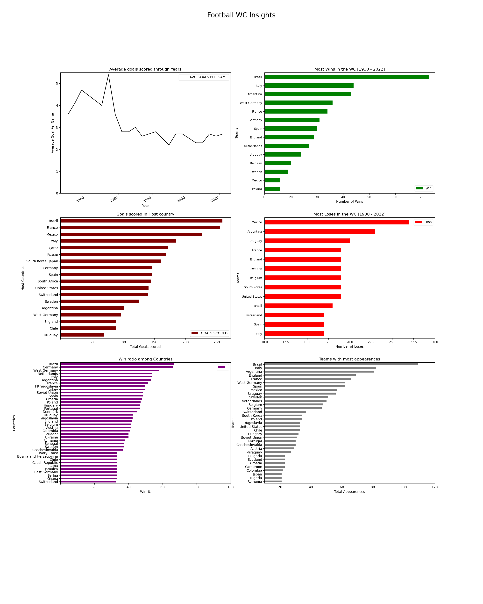

### EDA on WC dataset
__This time I thought to do EDA on Football WC dataset. Went through few talks and got some idea of how to go about doing EDA.__ 
I took WC[1993-2022] datset which was available on [Kaggle](https://www.kaggle.com/datasets/iamsouravbanerjee/fifa-football-world-cup-dataset) and tried answer few of Questions I came up with such as - 

1. Which team has made the most number of apperances till now in the WC [1930 - 2022].
2. How has the AVG goal per game has trended through out the years.
3. Which host nation which had most goals scored during WC.
4. Teams with most wins and most loses. 
5. Most win ratio.

__Well to my Surprise the stat which surprised me the post is Argentina is the second team in terms of the most loses in the history of FIFA WC meanwhile winning 3 Worldcups.__
